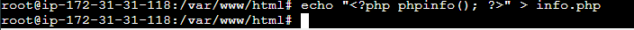
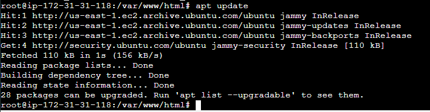

# ACTIVIDAD 1.3.1: Instalación de la pila LAMP (Linux, apache, MariaDB y PHP) en una instancia EC2 de AWS con Debian/Ubuntu Server  

## Instalación de PHP 

#### Actualizamos los repositorios

#### Instalamos Apache2

#### Instalamos PHP

#### Editamos el sitio web por defecto en el fichero 000-default.conf

#### Reiniciamos el servicio apache2 porque hemos modificado un fichero de configuracion.

#### Comprobación de LAMP stack.

## Instalación de MariaDB

#### Actualizamos los repositorios

#### Instalamos el servidor de base de datos y cliente

####

Paso 1: Actualización repositorios:
Paso 2: Instalación servidor de base de datos y cliente
Paso 3: Acceso a MariaDB desde consola servidor
Paso 4: Cambiar la contraseña de root