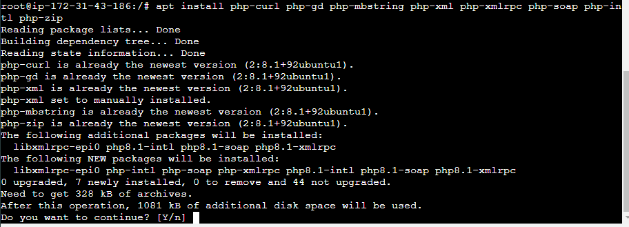
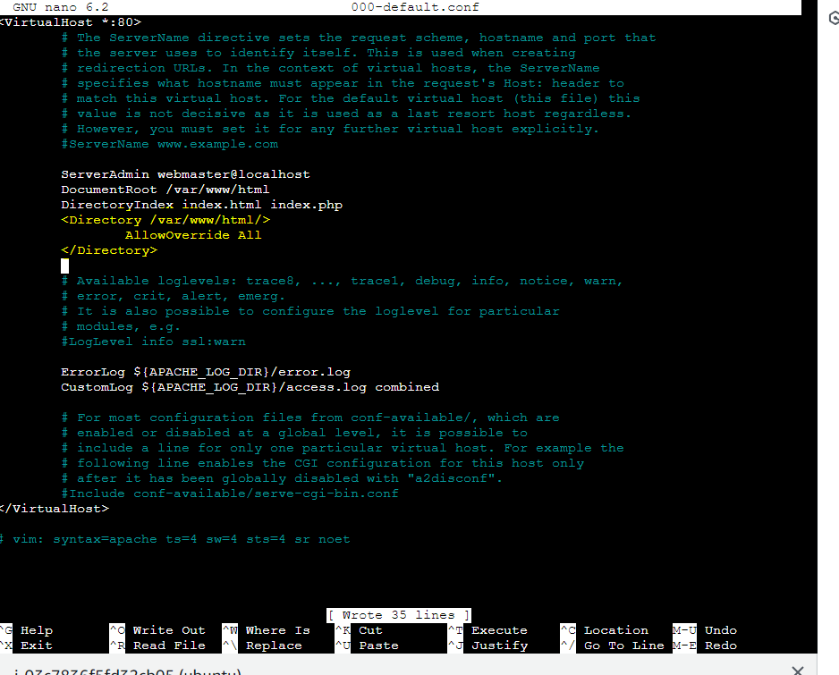
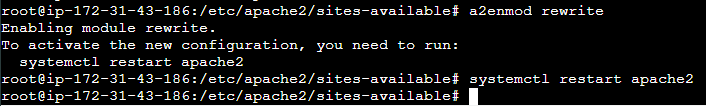
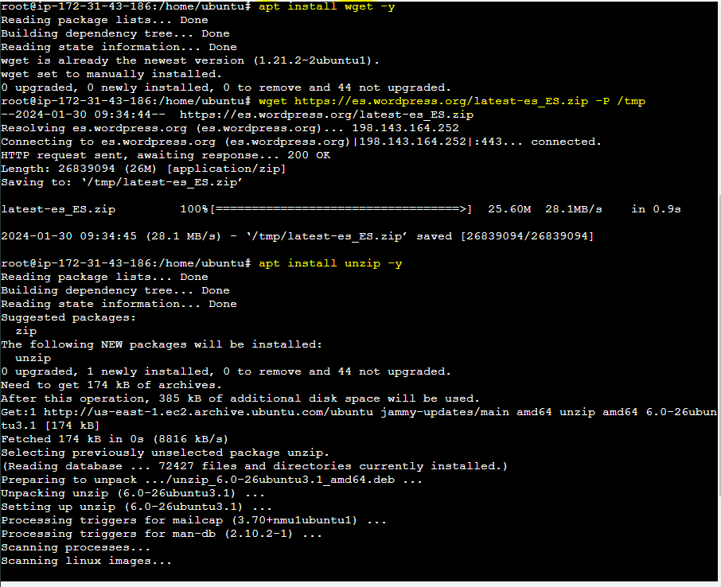
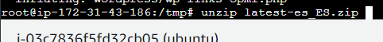
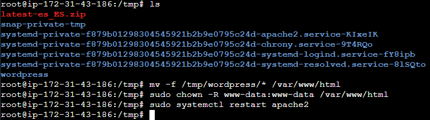
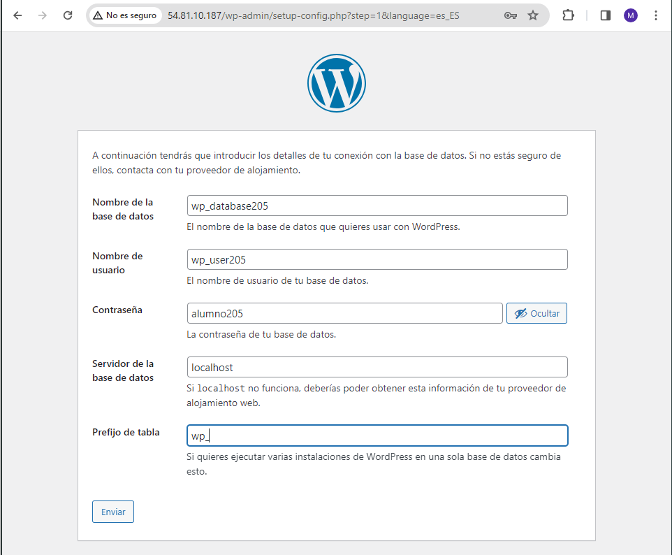
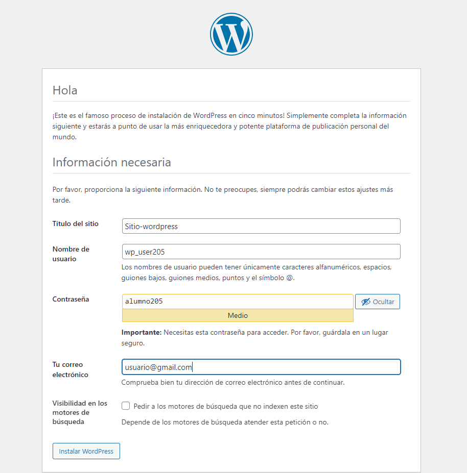
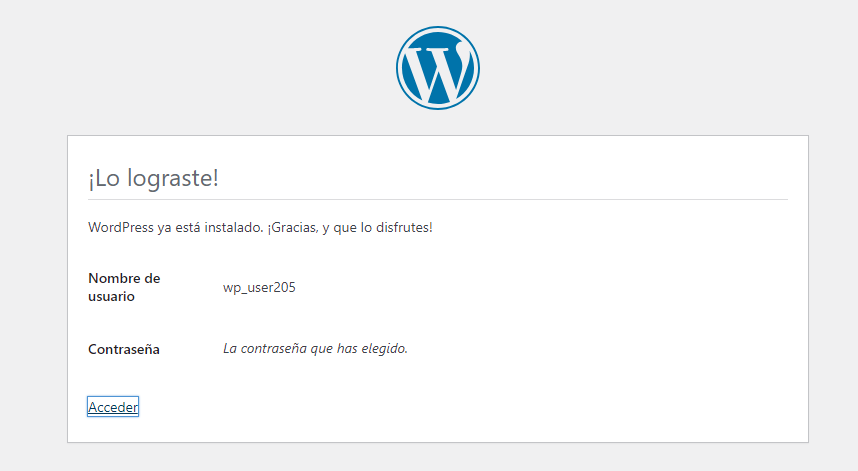

# 1.3.2 Instalación de WordPress en una instancia EC2 de AWS

#### Instalamos los paquetes php necesarios para wordpress

#### Creamos y configuramos la base de datos

#### Configuramos el servidor apache2

#### Activamos el mod_rewrite para utilizar la función de permalink o enlace permanente de WordPress y reiniciamos el servicio

#### Descargamos wordpress e instalamos la herramienta para descomprimir archivos

#### Descomprimimos con el comando "unzip archivo" el archivo latest-es_ES.zip

#### Comprobamos el funcionamiento de wordpress y configuramos lo que nos pide

