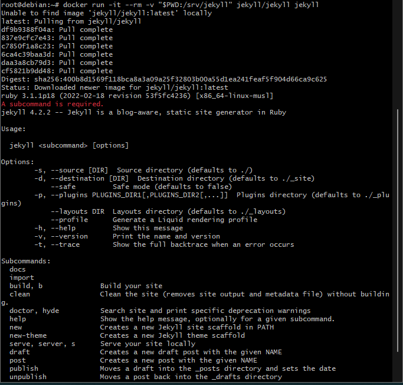
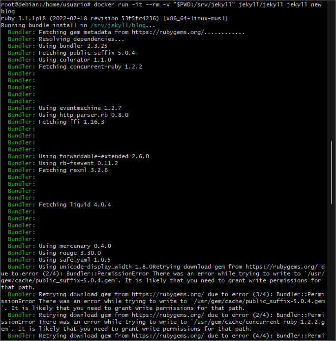
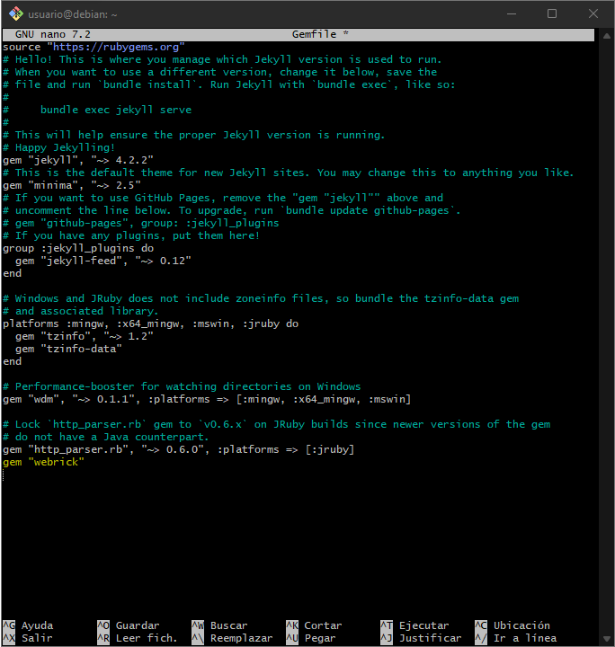
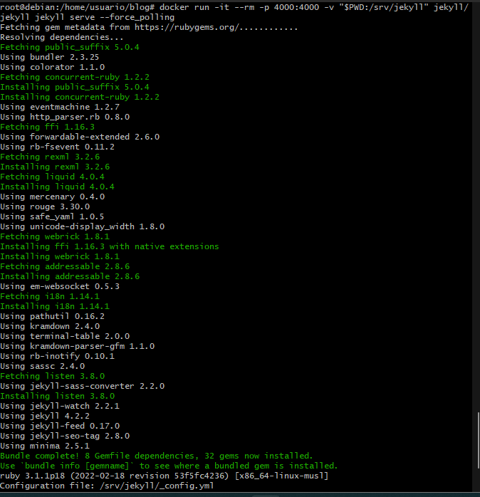
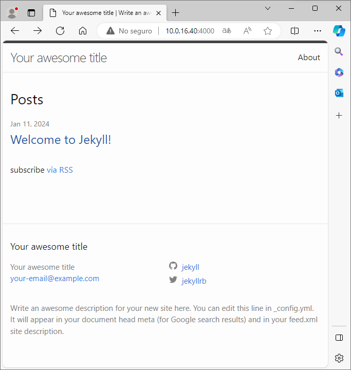

# Sitio Local en Jekyll con Docker

```
Antes de empezar a usar los comandos de este documento deberemos estar con el usuario: root.
```

## Creamos un contenedor Docker con Jekyll:

```
El comando necesario es:
docker run -it --rm -v "$PWD:/srv/jekyll" jekyll/jekyll jekyll
```



## Creamos la estructura de directorios y los archivos necesarios para un proyecto Jekyll nuevo:

Antes de usar este comando debemos estar en la siguiente ruta: /home/usuario

```
El comando necesario es:
docker run -it --rm -v "$PWD:/srv/jekyll" jekyll/jekyll jekyll new blog
```



## Modificamos el archivo gemfile, el la parte de abajo añadimos gem "webrick"



## Con este comando nos permite servir de forma local un sitio HTML estatico generado a partir del proyecto:

```
El comando necesario es:
docker run -it --rm -p 4000:4000 -v "$PWD:/srv/jekyll" jekyll/jekyll jekyll serve --force_polling
```


## Ahora para ver nuestro sitio web debemos abrir un navegador web de estas 2 formas:

### Opcion 1 si lo hacemos en local:

```
http://127.0.0.1:4000
```

### Opcion 1 si lo hacemos desde otra maquina:

```
http://IP_maquina:4000
```

